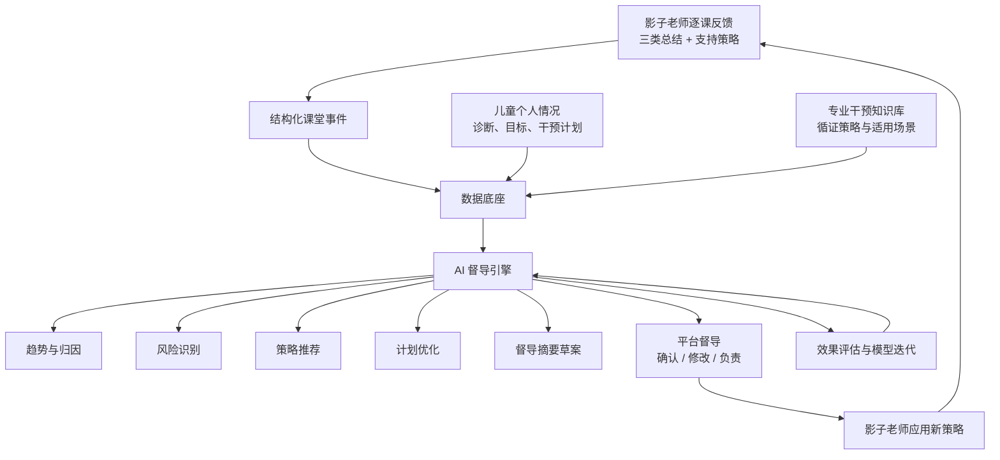

# 影子老师在线 AI 督导：架构规划

## 1. 定位

在线 AI 督导不是替代现有的人工专业督导，而是在「逐课反馈 → 校方核验 → 家长查看」这条质量闭环之上，增加一层**持续、可解释、以结果为导向的干预辅助引擎**。

它的核心职责只有一件事：**帮助影子老师改进干预方式，提高干预效果**。

因此 AI 督导的输出不能只是「写得好不好」，而必须是「这条干预策略是否有效、下一步该怎么调、为什么」。

## 2. 设计原则

- 以结果为导向：优先评估干预效果，而不是反馈填写是否完整。
- 人在环路：AI 只产出建议和草案，平台督导负责确认、修改和负责。
- 可解释、可追溯：每一条建议都要能追溯到具体的课堂记录、知识依据和儿童目标。
- 渐进增强：先用规则和检索解决高频问题，再用大模型做自然语言推理，不一步到位。
- 隐私与伦理优先：特殊儿童数据严格脱敏，不给出诊断，不替代专业判断。

## 3. 总体架构

## 4. 分层设计

### 4.1 数据底座

现有演示版已经具备不错的雏形，需要继续结构化：

| 数据 | 现状 | 需要补齐 |
| --- | --- | --- |
| 逐课反馈 | 已有社交情况、学习习惯、情绪控制三类 + 进步/需关注两色 | 补充行为编码、前因、干预技巧、目标关联、结果强度 |
| 课程表 | 已数字化为表格 | 关联到每天的反馈事件 |
| 学期干预计划 | 已有月份、重点、目标、状态 | 把目标拆成可测量的阶段目标 |
| 儿童画像 | 已有年级、月变化 | 增加诊断类型、基线评估、支持需求等级 |
| 专业知识库 | 尚未建立 | 建立干预技巧、适用场景、证据等级的图谱 |
| 人工督导记录 | 已有督导预约与时长 | 增加督导结论、建议被采纳后的效果 |

### 4.2 数据接入与标准化

把老师用自然语言写的反馈，转成机器可用的结构：

- 行为分类：统一到社交、学习习惯、情绪控制三个领域，再向下细分子类。
- 干预技巧标签：视觉提示、口头提示、任务拆分、轮次卡、同伴强化、情绪识别等。
- 事件结构：前因（A）→ 行为（B）→ 结果（C），便于做归因。
- 脱敏流水线：去儿童姓名、人脸、地点、学校，保留干预相关特征。

### 4.3 知识与画像

- **干预知识图谱**：把「儿童特点 × 行为领域 × 干预技巧 × 证据等级 × 适用场景」连成网络。
- **儿童动态画像**：记录该儿童对每类干预策略的反应、进步速度和当前瓶颈，随时间更新。

### 4.4 AI 督导引擎

建议采用「规则 + 检索 + 大模型」的混合策略：

- 规则层：处理可枚举的高频问题，例如某类「需关注」事件连续出现、目标长期无进展。
- 检索层：从知识库中召回与当前儿童特点和问题最匹配的循证策略。
- 生成层：用大模型把「儿童现状 + 目标 + 候选策略 + 历史效果」组织成可读、可执行的督导建议，并给出依据。

输出统一带证据链：`问题 → 证据记录 → 候选策略 → 预期目标 → 风险提示`。

### 4.5 人工督导闭环

AI 产出的是「督导建议草案」，不是最终结论：

1. AI 生成建议草案和依据。
2. 平台督导确认、修改或驳回。
3. 影子老师应用新策略并记录后续课堂结果。
4. 系统把「建议是否被采纳、采纳后效果是否提升」回流给引擎。

人工督导的决定是最重要的训练信号，但需要版本管理和定期复盘，避免模型被单一个案带偏。

### 4.6 效果评估与治理

衡量 AI 督导是否有效，不看「生成了多少条建议」，而看：

- 建议采纳率：影子老师是否愿意用。
- 干预效果变化：同一目标下「需关注」事件是否下降、进步是否加快。
- 目标达成与毕业结果：是否更快、更稳地达到阶段目标。
- 专业核验率：校方确认的真实性。

同时保留完整的审计日志，确保每条建议都能被复现和质疑。

## 5. 数据模型演进建议

在现有 `lessons`、`interventionPlan`、`child` 的基础上，新增三类实体：

- `goals`：可测量的阶段目标，关联到干预计划的某个阶段。
- `supervisionSessions`：AI 草案、人工决定、采纳结果、效果回传。
- `knowledgeBase`：干预技巧、适用场景、证据等级、来源。

这些可以先作为只读的「规划字段」进入模型，不必立刻实现 AI 计算。

## 6. 分阶段落地

1. **第一阶段：结构化与看板**。把反馈、目标、督导记录打通，先让老师和管理者看到「趋势」和「风险」。
2. **第二阶段：规则督导**。用规则识别目标停滞和高频需关注事件，自动生成提醒。
3. **第三阶段：检索推荐**。根据儿童特点和问题召回循证策略，附证据和来源。
4. **第四阶段：生成式督导**。引入大模型生成自然语言建议，并始终保留人工确认和效果回传。
5. **第五阶段：持续评估**。用采纳率和效果提升来校准模型，形成专业信用的一部分。

## 7. 与专业信用体系的关系

AI 督导产生的有效改进可以成为影子老师专业信用的一部分，但建议独立于「毕业案例」这类结果指标，避免为了刷数据而过度记录。督导效果应当作为过程性证据，毕业案例仍然是最高的结果性证据。
